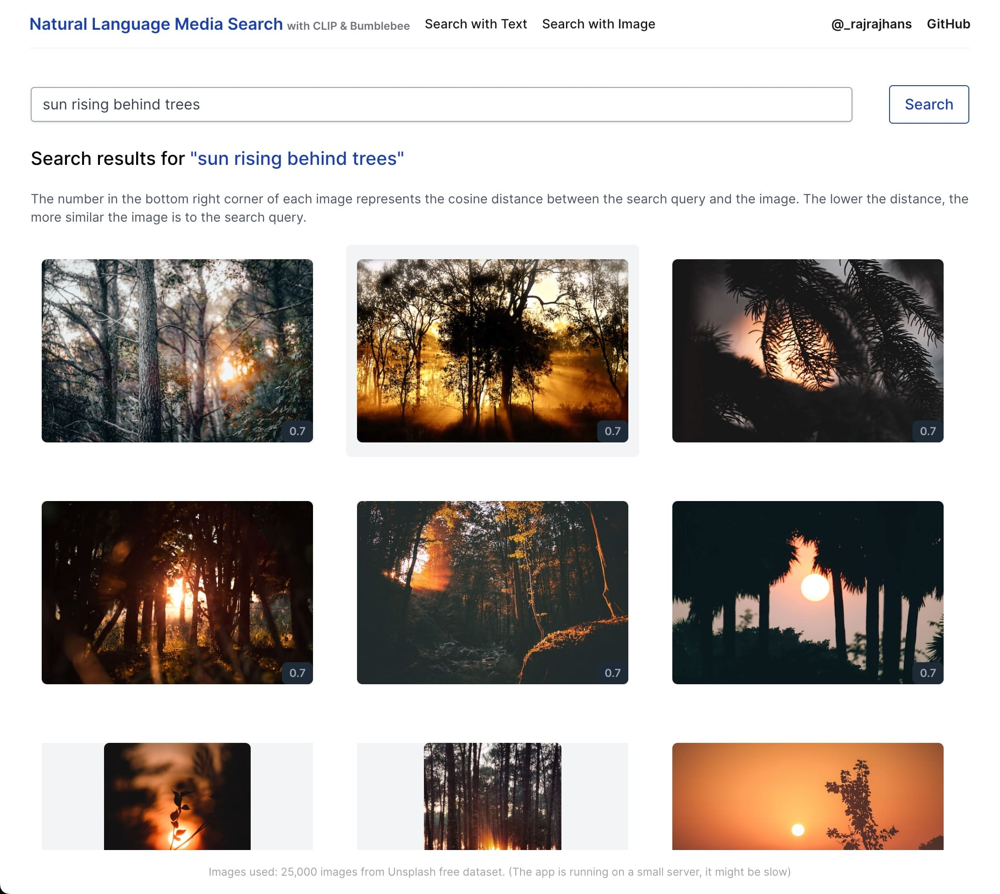
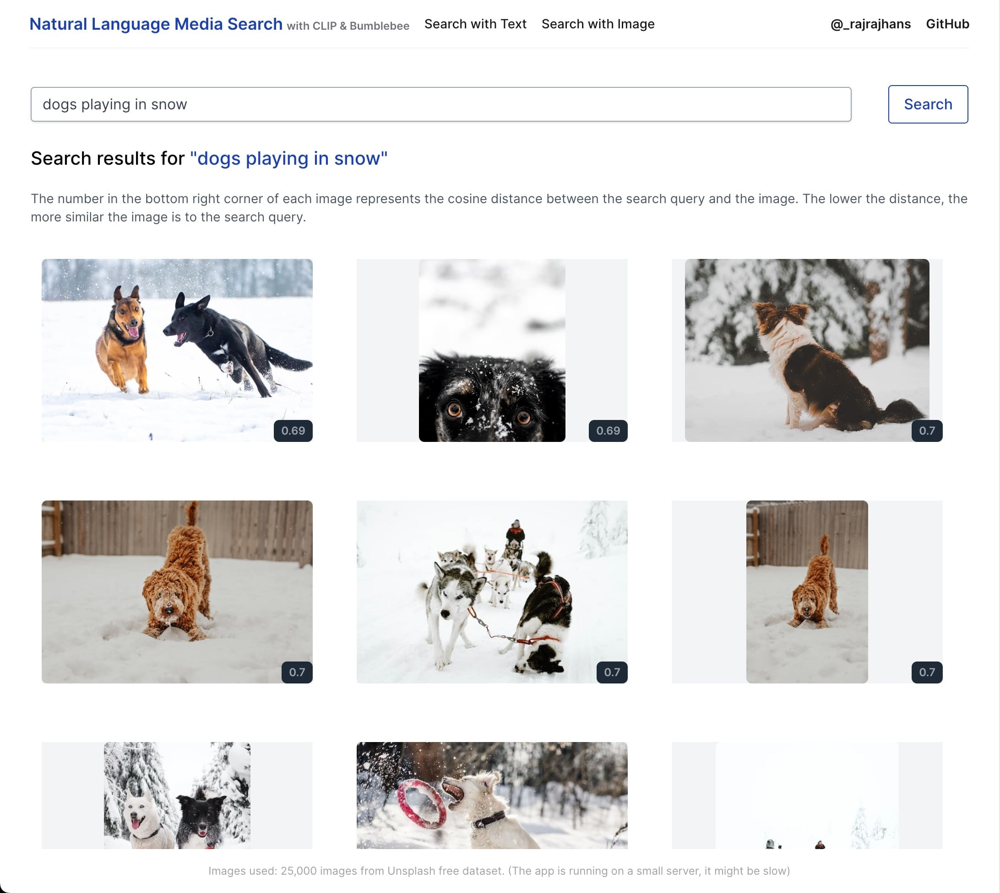

# Bumblebee Media Search

- A demo application that uses the [CLIP model](https://openai.com/research/clip) for natural language media search (searching images with text, and searching related images with an image).
- Presented at [ElixirConf Africa 2023 for the talk "Natural Language Media Search with Elixir , Bumblebee and Nx."](https://elixirconf.africa/sessions/natural-language-media-search-with-elixir-bumblebee-and-nx). Slides can be found [here](https://assets.rajrajhans.com/bumblebee-media-search/slides_raj_rajhans_elixir_conf_africa_2023.pdf)
- Built using [Phoenix Framework](https://github.com/phoenixframework/phoenix), [Bumblebee](https://github.com/elixir-nx/bumblebee), [Axon](https://github.com/elixir-nx/axon), [Nx](https://github.com/elixir-nx/nx) and [HNSWLib](https://github.com/elixir-nx/hnswlib).

## Sneak Peek: Searching Images with Text

|  |  |  |
| ----------------------------------------------------------------- | ----------------------------------------------------------------- | ----------------------------------------------------------------- |

## Sneak Peek: Searching Images with an Image

|  |  |  |
| --------------------------------------------------------------------- | ---------------------------------------------------------------------- | --------------------------------------------------------------------- |

## Installation

- Uses Nix for dependency management. [Install Nix](https://nixos.org/download.html) if you don't have it already.
- Clone the repository and run `direnv allow` to activate the environment.
- To install dependencies, execute `run deps`.
- To start the server, execute `run server`.

## Using with Your Images

- Create a directory `priv/images` and copy all your images to this directory.
- Run the function [`build_index`](./lib/media_search_demo/clip/clip_index.ex) to create an index from the images. It will vectorize the images, create index and save it to `priv/clip_index.ann` and `priv/clip_index_filenames.json` files. To run the function, start the server using `run mix phx.server` and then run the function in `iex` shell using `MediaSearchDemo.Clip.build_index()`.

## Using with Unsplash Sample Dataset (25,000 images)

- Download the dataset from [https://unsplash.com/data/lite/latest](https://unsplash.com/data/lite/latest).
- Extract and copy the `photos.tsv000` file to `priv` directory. (You can directly download the `photos.tsv` file from [here](https://assets.rajrajhans.com/bumblebee-media-search/unsplash-25k/photos.tsv000) without downloading the whole dataset).
- Run the script [`download_unsplash_dataset.ex`](./priv/scripts/download_unsplash_dataset.ex) by `run elixir priv/scripts/download_unsplash_dataset.ex` to download the images from the dataset. It will concurrently download images to `priv/images` directory.
- Once the images are downloaded to `priv/images` directory, you have two options:
  1. Follow the steps in [Using with Your Images](#using-with-your-images) section to create an index from the 25k Unsplash images. (will take some time)
  2. Download the pre-built index files from [here](https://assets.rajrajhans.com/bumblebee-media-search/unsplash-25k/clip_index.ann) and [here](https://assets.rajrajhans.com/bumblebee-media-search/unsplash-25k/clip_index_filenames.json) and save both to `priv` directory.
