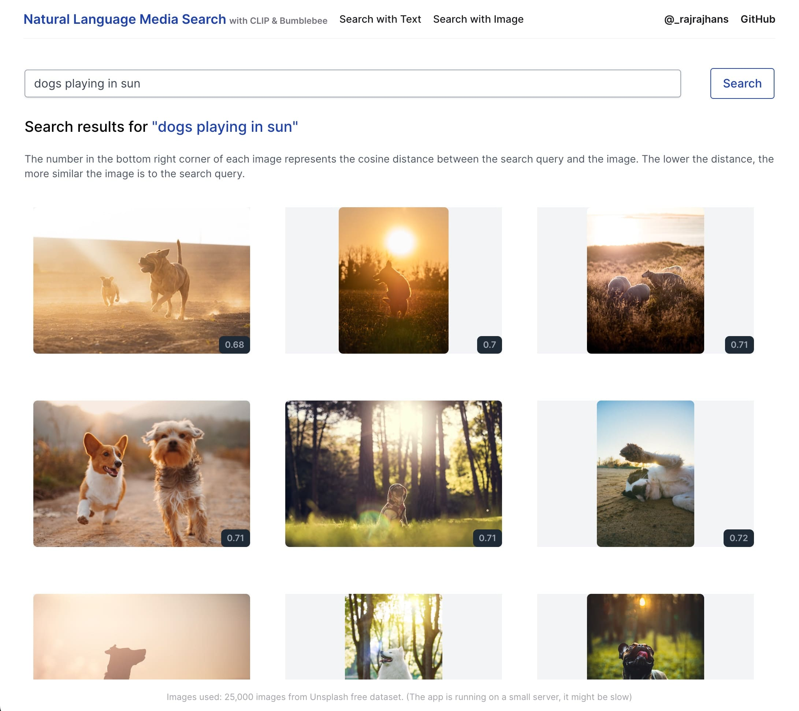
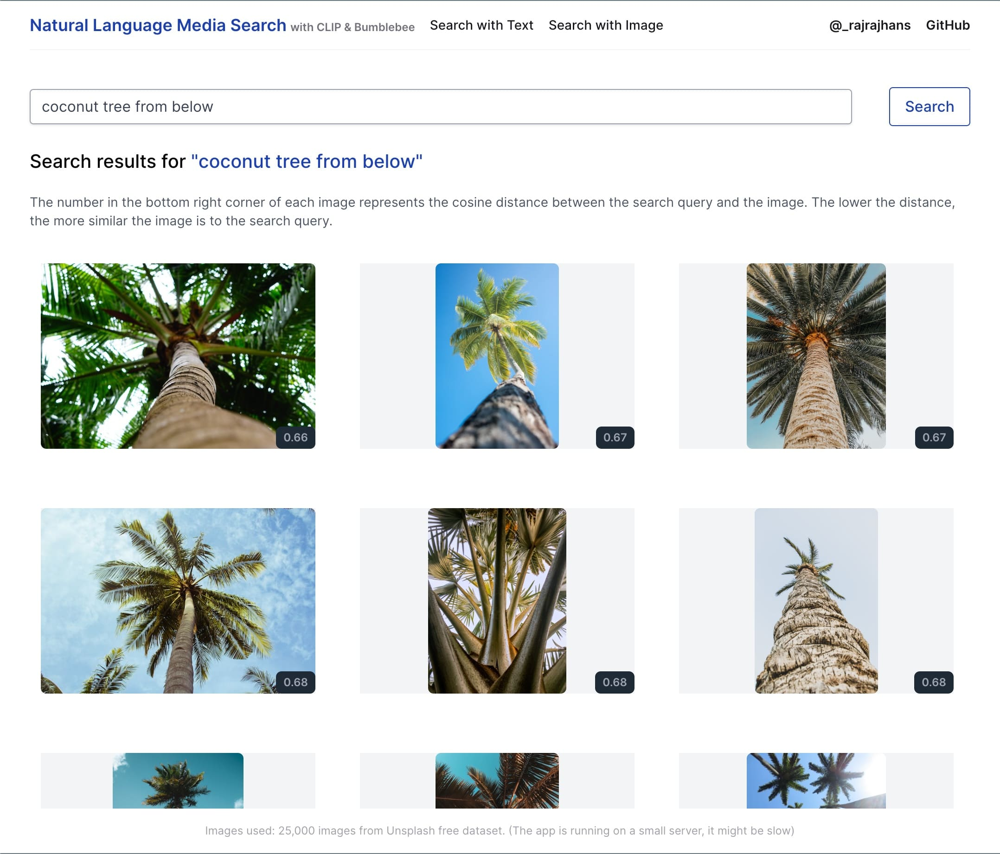
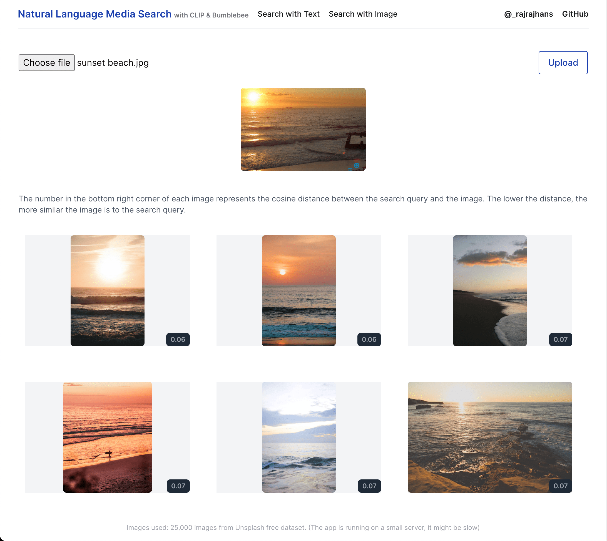

# Bumblebee Media Search

- A demo application that uses the [CLIP model](https://openai.com/research/clip) for natural language media search (searching images with text, and searching related images with an image).
- Built using [Phoenix Framework](https://github.com/phoenixframework/phoenix), [Bumblebee](https://github.com/elixir-nx/bumblebee), [Axon](https://github.com/elixir-nx/axon), [Nx](https://github.com/elixir-nx/nx) and [HNSWLib](https://github.com/elixir-nx/hnswlib).

## Sneak Peek: Searching for Images with Text

|  |  |
| ----------------------------------------------------------------- | ----------------------------------------------------------------- |
|  |  |

## Sneak Peek: Searching for Images with an Image

|  |  |
| --------------------------------------------------------------------- | ---------------------------------------------------------------------- |
|  |  |

## Nx Servings

- This uses Nx Servings for serving the CLIP model. There are two sets of Nx Servings in the codebase:
  1. [Nx Servings provided by Bumblebee for text & image embeddings](./lib/media_search_demo/clip/servings/bumblebee/): Using ready made Nx Servings provided by Bumblebee library.
  2. [Hand rolled Nx Servings for text & image embeddings](./lib/media_search_demo/clip/servings/custom/): Custom implemented Nx Servings intended to learn how to implement Nx Servings from scratch.
- Both provide the same output and can be used interchangeably. However, if you're interested in learning how Nx Serving works and how to implement them, the hand rolled Nx Serving files will be helpful.

## Installation

- Uses Nix for dependency management. [Install Nix](https://nixos.org/download.html) if you don't have it already.
- Clone the repository and run `direnv allow` to activate the environment.
- To install dependencies, execute `run deps`.
- To start the server, execute `run server`.

## Using with Your Images

- Create a directory `priv/images` and copy all your images to this directory.
- Run the function [`build_index`](./lib/media_search_demo/clip/clip_index.ex) to create an index from the images. It will vectorize the images, create index and save it to `priv/clip_index.ann` and `priv/clip_index_filenames.json` files. To run the function, start the server using `run mix phx.server` and then run the function in `iex` shell using `MediaSearchDemo.Clip.Index.build_index()`.

## Using with Unsplash Sample Dataset (25,000 images)

- Download the dataset from [https://unsplash.com/data/lite/latest](https://unsplash.com/data/lite/latest).
- Extract and copy the `photos.tsv000` file to `priv` directory. (You can directly download the `photos.tsv` file from [here](https://assets.rajrajhans.com/bumblebee-media-search/unsplash-25k/photos.tsv000) without downloading the whole dataset).
- Run the script [`download_unsplash_dataset.ex`](./priv/scripts/download_unsplash_dataset.ex) by `run elixir priv/scripts/download_unsplash_dataset.ex` to download the images from the dataset. It will concurrently download images to `priv/images` directory.
- Once the images are downloaded to `priv/images` directory, you have two options:
  1. Follow the steps in [Using with Your Images](#using-with-your-images) section to create an index from the 25k Unsplash images. (will take some time)
  2. Download the pre-built index files from [here](https://assets.rajrajhans.com/bumblebee-media-search/unsplash-25k/clip_index.ann) and [here](https://assets.rajrajhans.com/bumblebee-media-search/unsplash-25k/clip_index_filenames.json) and save both to `priv` directory.

## How does it work?

- The application uses the [CLIP model](https://openai.com/research/clip) with Bumblebee and Nx to create an index of images and then search the index for related images.
- For more details, please check the talk slides. Slides can be found [here](https://assets.rajrajhans.com/bumblebee-media-search/slides_raj_rajhans_elixir_conf_africa_2023.pdf)
